# Relatório de testes manuais (QA) — Gestão de Tarefas

Testes funcionais executados manualmente contra a API em execução, pela interface do **Swagger UI**
(`http://localhost:5090/swagger`). Cada endpoint foi exercitado nos caminhos de sucesso e de erro,
com captura da resposta real do servidor como evidência.

- **Ambiente:** aplicação em `Development`, persistência EF Core InMemory, porta 5090.
- **Método:** requisições disparadas pelo Swagger Ui (botão *Execute*). Para o caso de status inválido,
  usou-se a URL diretamente, pois o Swagger restringe o parâmetro a um seletor de valores válidos.
- **Legenda de resultado:** ✓ = resultado obtido igual ao esperado.

## Visão geral dos endpoints

Os cinco endpoints publicados, com descrições vindas da documentação OpenAPI.

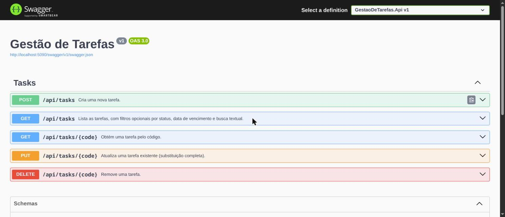

---

## 1. POST /api/tasks — Criar tarefa

### 1.1 Sucesso (feliz)
- **Teste:** criar tarefa com corpo válido (título, descrição, data e status).
- **Esperado:** `201 Created`, corpo com o `code` gerado e os links HATEOAS; header `Location`.
- **Obtido:** `201`, `code` = `TSK-E5C90E18`, corpo completo e `_links`. ✓

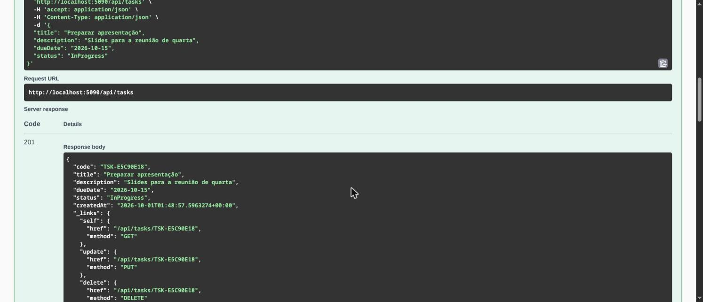

### 1.2 Erro — título vazio (triste)
- **Teste:** criar tarefa com `title` vazio.
- **Esperado:** `400 Bad Request` em formato Problem Details, com erro no campo `Title`.
- **Obtido:** `400`, `errors.Title = ["Title is required."]`, `content-type: application/problem+json`. ✓

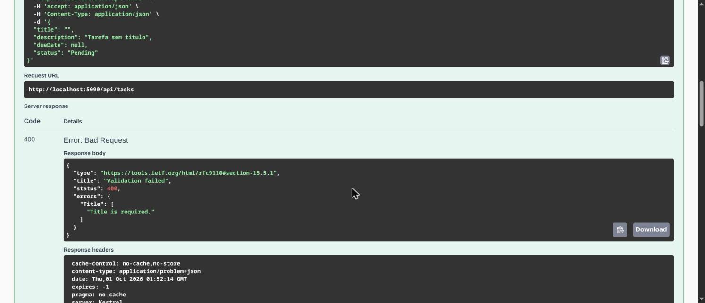

---

## 2. GET /api/tasks — Listar tarefas

### 2.1 Sucesso — listar todas (feliz)
- **Teste:** listar sem filtros.
- **Esperado:** `200 OK` com um array de tarefas, cada uma com `_links`.
- **Obtido:** `200`, array com as tarefas existentes. ✓

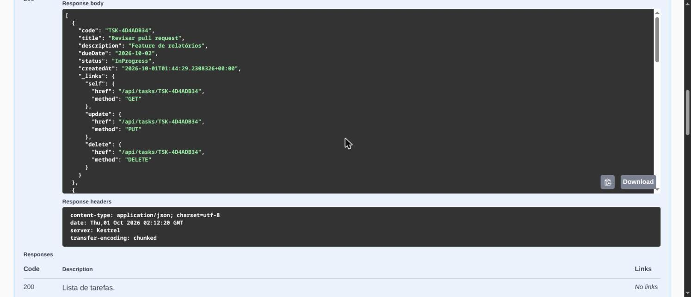

### 2.2 Sucesso — busca textual (feliz)
- **Teste:** `?search=apresenta` (busca em título/descrição).
- **Esperado:** `200 OK` retornando apenas as tarefas que contêm o termo.
- **Obtido:** `200`, retornou somente a tarefa "Preparar apresentação". ✓

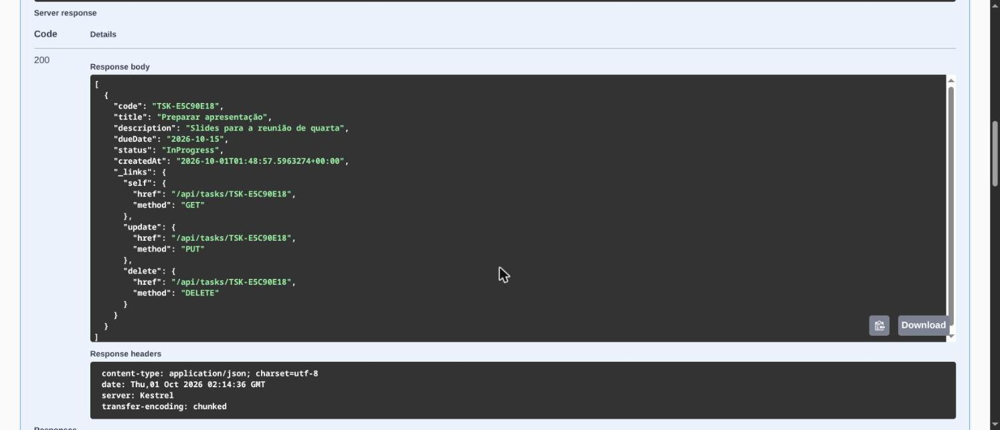

### 2.3 Erro — status inválido (triste)
- **Teste:** `?status=Banana` (valor fora do enum).
- **Esperado:** `400 Bad Request` em Problem Details.
- **Obtido:** `400`, `errors.status = ["The value 'Banana' is not valid."]`. ✓

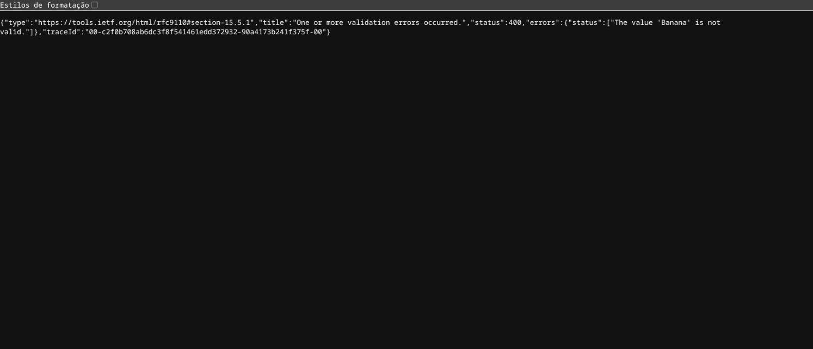

---

## 3. GET /api/tasks/{code} — Obter por código

### 3.1 Sucesso (feliz)
- **Teste:** obter com um código existente (`TSK-E5C90E18`).
- **Esperado:** `200 OK` com a tarefa correspondente.
- **Obtido:** `200`, tarefa retornada com `_links`. ✓

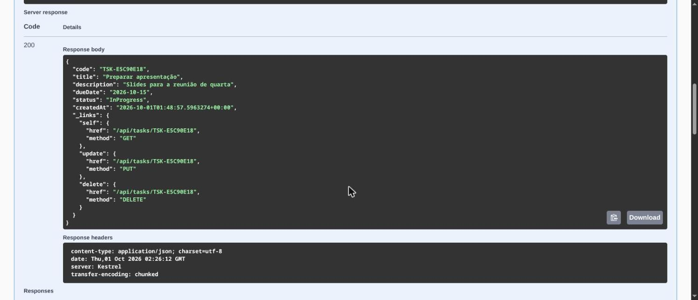

### 3.2 Erro — código inexistente (triste)
- **Teste:** obter com um código que não existe (`TSK-NAOEXISTE`).
- **Esperado:** `404 Not Found` em Problem Details.
- **Obtido:** `404`, `detail = "Task 'TSK-NAOEXISTE' was not found."`. ✓

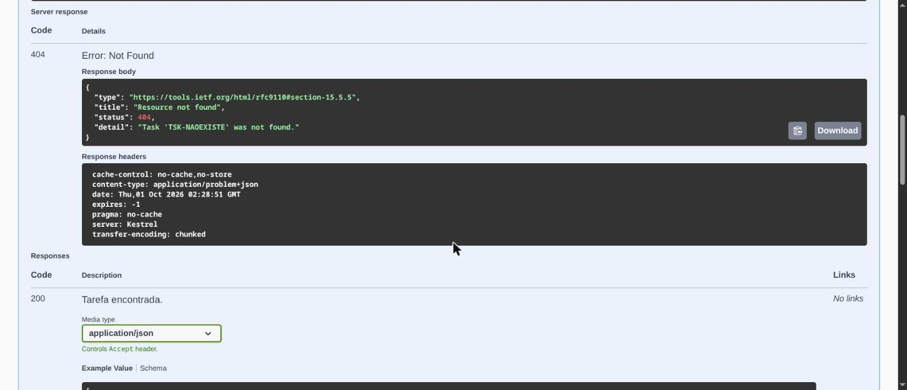

---

## 4. PUT /api/tasks/{code} — Atualizar tarefa

### 4.1 Sucesso (feliz)
- **Teste:** atualizar tarefa existente com corpo completo (título, descrição, data, status).
- **Esperado:** `200 OK` com a tarefa atualizada.
- **Obtido:** `200`, título, `status` (`Done`) e `dueDate` atualizados. ✓

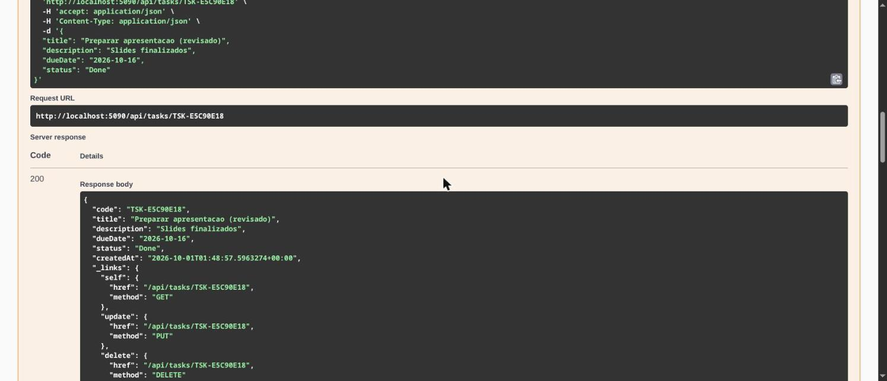

### 4.2 Erro — status ausente (triste)
- **Teste:** atualizar sem o campo `status` (PUT é substituição completa).
- **Esperado:** `400 Bad Request`, pois `status` é obrigatório no PUT.
- **Obtido:** `400`, `errors.Status = ["Status is required."]`. ✓

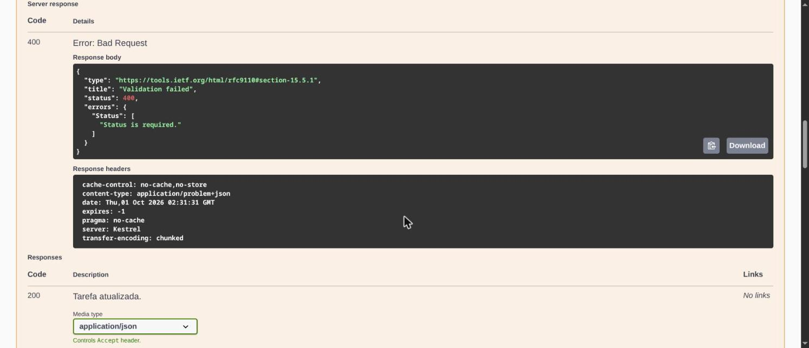

### 4.3 Erro — código inexistente (triste)
- **Teste:** atualizar um código que não existe, com corpo válido.
- **Esperado:** `404 Not Found` (passa na validação, mas o recurso não existe).
- **Obtido:** `404`, `detail = "Task 'TSK-NAOEXISTE' was not found."`. ✓

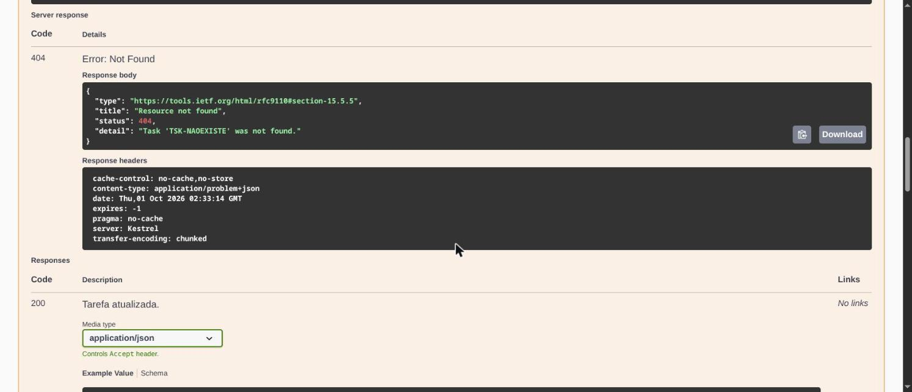

---

## 5. DELETE /api/tasks/{code} — Remover tarefa

### 5.1 Sucesso (feliz)
- **Teste:** remover tarefa existente (`TSK-E5C90E18`).
- **Esperado:** `204 No Content`, sem corpo de resposta.
- **Obtido:** `204`, sem corpo. ✓

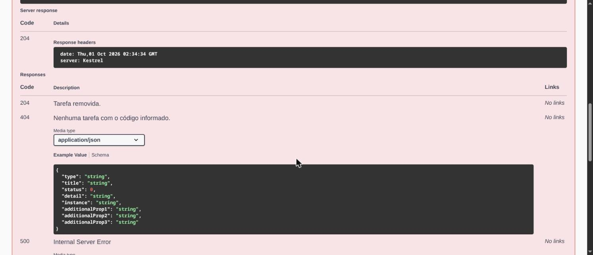

### 5.2 Erro — código inexistente (triste)
- **Teste:** remover novamente o mesmo código (já removido no passo anterior).
- **Esperado:** `404 Not Found`, confirmando que a remoção anterior ocorreu.
- **Obtido:** `404`, `detail = "Task 'TSK-E5C90E18' was not found."`. ✓

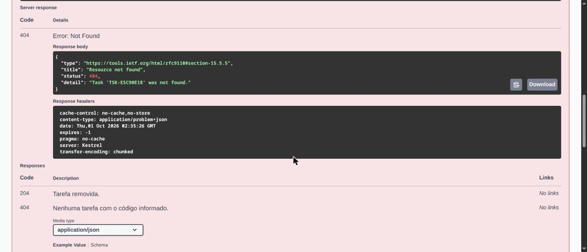

---

## Resumo

| # | Endpoint | Cenário | Esperado | Resultado |
|---|---|---|---|---|
| 1.1 | POST /api/tasks | Corpo válido | 201 | ✓ |
| 1.2 | POST /api/tasks | Título vazio | 400 | ✓ |
| 2.1 | GET /api/tasks | Listar todas | 200 | ✓ |
| 2.2 | GET /api/tasks | Busca textual | 200 | ✓ |
| 2.3 | GET /api/tasks | Status inválido | 400 | ✓ |
| 3.1 | GET /api/tasks/{code} | Código existente | 200 | ✓ |
| 3.2 | GET /api/tasks/{code} | Código inexistente | 404 | ✓ |
| 4.1 | PUT /api/tasks/{code} | Corpo válido | 200 | ✓ |
| 4.2 | PUT /api/tasks/{code} | Sem status | 400 | ✓ |
| 4.3 | PUT /api/tasks/{code} | Código inexistente | 404 | ✓ |
| 5.1 | DELETE /api/tasks/{code} | Código existente | 204 | ✓ |
| 5.2 | DELETE /api/tasks/{code} | Código inexistente | 404 | ✓ |

Todos os 12 cenários passaram. As respostas de erro seguem o formato Problem Details (RFC 7807) com
`content-type: application/problem+json`, e as respostas de sucesso retornam `application/json`.

## Observações de QA

- **Cobertura automatizada complementar:** além destes testes manuais, o projeto possui 38 testes
  automatizados (`dotnet test`) cobrindo domínio, serviço, validações e cenários ponta a ponta; os
  resultados manuais acima são consistentes com eles.
- **Dados em memória:** por usar EF InMemory, os dados são recriados a cada reinício da aplicação; em
  `Development` há uma carga inicial de exemplos.
- **Fora do escopo deste teste funcional**: testes de carga/desempenho, segurança e autenticação, e
  concorrência — não exigidos para esta entrega.
